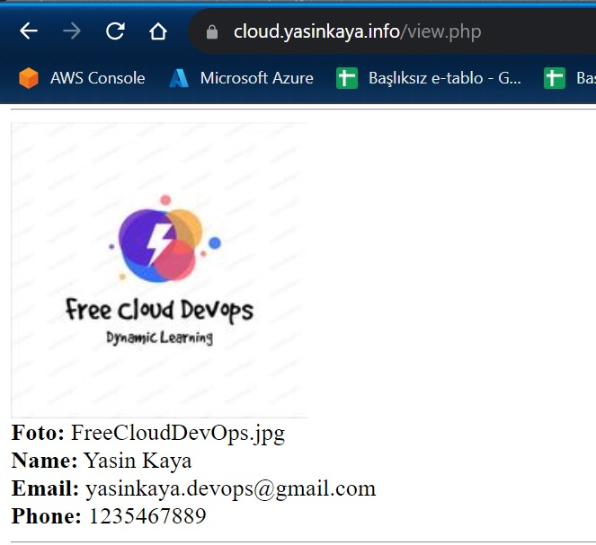
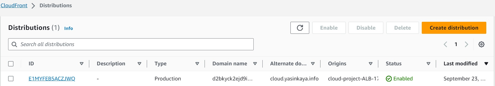

# Project-06 : Image Add Application With Description (PHP) deployed on AWS Application Load Balancer with Auto Scaling, S3, Relational Database Service(RDS), VPC's Components, Elastic File System(EFS) and Cloudfront with Route 53

## Description

The Image Insertion Application With Description aims to deploy  as a web application written PHP on AWS Cloud Infrastructure. This infrastructure has Application Load Balancer with Auto Scaling Group of Elastic Compute Cloud (EC2) Instances and Relational Database Service (RDS) on defined VPC. Also, The Cloudfront and Route 53 services are located in front of the architecture and manage the traffic in secure. Data is stored in EFS. User is able to upload pictures, add description to this pictures on own page and this pictures are kept on S3 Bucket.  




## Steps to Solution
  
## Step 1: Create dedicated VPC and whole components


### VPC
- Create VPC:
    create a vpc named `cloud-project-vpc` CIDR blok is `10.10.0.0/16` 
    no ipv6 CIDR block
    tenancy: default
- select `cloud-project-vpc` VPC, click `Actions`, `Edit VPC settings` and `enable DNS hostnames` for the `cloud-project`. 


### Subnets
- Create Subnets
    - Create a public subnet named `cloud-project-subnet-public1-us-east-1a` under the vpc cloud-project in AZ us-east-1a with 10.10.10.0/24
    - Create a private subnet named `cloud-project-subnet-private1-us-east-1a` under the vpc cloud-project in AZ us-east-1a with 10.10.11.0/24
    - Create a public subnet named `cloud-project-subnet-public2-us-east-1b` under the vpc cloud-project in AZ us-east-1a with 10.10.20.0/24
    - Create a private subnet named `cloud-project-subnet-private2-us-east-1b` under the vpc cloud-project in AZ us-east-1a with 10.10.21.0/24

- Set `auto-assign IP` up for public subnets. Select each public subnets and click Modify "auto-assign IP settings" and select "Enable auto-assign public IPv4 address" 

### Internet Gateway
- Click Internet gateway section on left hand side. Create an internet gateway named `cloud-project-igw` and create.

- ATTACH the internet gateway `cloud-project-igw` to the newly created VPC `cloud-project-vpc`. Go to VPC and select newly created VPC and click action ---> Attach to VPC ---> Select `cloud-project-vpc` VPC 

### Route Table
- Go to route tables on left hand side. We have already one route table as main route table. Change it's name as `cloud-project-rtb-public` 
- Create a route table and give a name as `cloud-project-rtb-private`.
- Add a rule to `cloud-project-rtb-public` in which destination 0.0.0.0/0 (any network, any host) to target the internet gateway `cloud-project-igw` in order to allow access to the internet.
- Select the private route table, come to the subnet association subsection and add private subnets to this route table. Similarly, we will do it for public route table and public subnets. 
    
### Endpoint
- Go to the endpoint section on the left hand menu
- select endpoint ---> click Create endpoint
```text
Name : cloud-project-vpc-s3
Service Category: AWS services
Service  : `com.amazonaws.us-east-1.s3` ---> Gateway
VPC           : `cloud-project-vpc`
Route Table   : private route tables
Policy        : `Full Access`
Create
```


## Step 2: Create Security Groups (ALB ---> EC2 ---> RDS ---> EFS)


1. ALB Security Group
```text
Name            : cloud-project-ALB_Sec_Group
Description     : ALB Security Group allows traffic HTTP and HTTPS ports from anywhere 
Inbound Rules
VPC             : cloud-project-vpc
HTTP(80)    ----> anywhere
HTTPS (443) ----> anywhere
```
2. NAT Instance Security Group
```text
Name            : cloud-project-NAT_Sec_Group
Description     : NAT Security Group allows traffic HTTP and HTTPS and SSH ports from anywhere 
Inbound Rules
VPC             : cloud-project-vpc
HTTP(80)    ----> anywhere
HTTPS (443) ----> anywhere
SSH (22)    ----> anywhere
```
3. EC2 Security Groups
```text
Name            : cloud-project-EC2_Sec_Group
Description     : EC2 Security Groups only allows traffic coming from cloud-project-ALB_Sec_Group Security Groups for HTTP and HTTPS ports. In addition, ssh port is allowed from anywhere
VPC             : cloud-project-vpc
Inbound Rules
HTTP(80)    ----> cloud-project-ALB_Sec_Group
HTTPS (443) ----> cloud-project-ALB_Sec_Group
ssh         ----> cloud-project-NAT_Sec_Group
```
4. RDS Security Groups
```text
Name            : cloud-project-RDS_Sec_Group
Description     : EC2 Security Groups only allows traffic coming from cloud-project-EC2_Sec_Group Security Groups for MYSQL/Aurora port. 

VPC             : cloud-project-vpc
Inbound Rules
MYSQL/Aurora(3306)  ----> cloud-project-EC2_Sec_Group
```
5. EFS Security Groups
```text
Name            : cloud-project-EFS_Sec_Group
Description     : EFS Security Groups only allows traffic coming from cloud-project-EC2_Sec_Group Security Groups for NFS port.
VPC             : cloud-project-vpc
Inbound Rules
NFS(2049)    ----> cloud-project-EC2_Sec_Group
```
## Step 3: Create three S3 Buckets and set one of these as static website.
Go to the S3 Consol and create three buckets. 


1. S3 Bucket that images added

- Click Create Bucket
```text
Bucket Name : <name>cloudproject
Region      : N.Virginia
create bucket
```
- Click Create folder
```text
Folder Name : images
create folder
```
2. S3 Bucket that images resized
- Click Create Bucket
```text
Bucket Name : <name>cloudproject-resized
Region      : N.Virginia
Block Public Access settings for this bucket
Block all public access : Unchecked
Other Settings are keep them as are
create bucket
```

- Click Permissions
```text
Bucket policy Edit Click :
```
```json
{
    "Version": "2008-10-17",
    "Statement": [
        {
            "Sid": "AllowPublicRead",
            "Effect": "Allow",
            "Principal": {
                "AWS": "*"
            },
            "Action": "s3:GetObject",
            "Resource": "arn:aws:s3:::yasincloudproject-resized/*"
        }
    ]
}
```

- Save changes

- Cross-origin resource sharing (CORS) Edit Click :

```json
[
    {
        "AllowedHeaders": [
            "*"
        ],
        "AllowedMethods": [
            "PUT",
            "POST",
            "GET"
        ],
        "AllowedOrigins": [
            "*"
        ],
        "ExposeHeaders": []
    }
]
```
- Save changes

3. S3 Bucket for failover scenario

- Click Create Bucket
```text
Bucket Name : cloud.yasinkaya.info
Region      : N.Virginia
Object Ownership
    - ACLs enabled
        - Bucket owner preferred
Block Public Access settings for this bucket
Block all public access : Unchecked
Please keep other settings as are
```
- create bucket

- Selects created `cloud.<YOUR DNS NAME>` bucket ---> Properties ---> Static website hosting
```text
Static website hosting : Enable
Hosting Type : Host a static website
Index document : index.html
save changes
```
- Select `cloud.<YOUR DNS NAME>` bucket ---> select Upload and upload `index.html` and `sorry.jpg` files from given folder---> Permissions ---> Access control list (ACL) ---> Choose from predefined ACLs ---> Grant public-read access  ( This allows Read for object)

## Step 4: Create IAM Role
Go to the IAM Consol and create two roles.


1. Lambda Role
- Click Create Roles and Create role
```text
Trusted entity type     :   AWS service
Use case                :   Lambda
Permissions policies    :   AWSLambdaExecute
Role name               :   Lambda-S3
Click Create Role
```
2. EC2 Role
- Click Create Roles and Create role
```text
Trusted entity type     :   AWS service
Use case                :   EC2
Permissions policies    :   AWSS3FullAccess
Role name               :   Ec2-S3
Click Create Role
```
## Step 5: Create Lambda-Function
Go to the Lambda Consol and create a function.


- Click Create funtion
- Author from scratch
```text
Basic information
Function name   : imagesresize
Runtime         : Node.js 14.x
Permissions
Use an existing role
Existing role : Lambda-S3
Click Create function

- Click Code source ---> Upload  from ---> .zip file
    - Upload ImageResize.zip
- Click Configuration ---> Edit General configuration
    - Timeout 15 sec

- Click Add trigger
    - Trigger configuration
    - S3
    - Bucket : yasincloudproject
    - Event types :All object create events
    - Recursive invocation select "I acknowledge that using the same S3 bucket for both input and output is not recommended and that this configuration can cause recursive invocations, increased Lambda usage, and increased costs."
    - Click Add
```
## Step 6: Create NAT Instance in Public Subnet
To launch NAT instance, go to the EC2 console and click the create button.


```text
Name : cloud-project-NAT-EC2
write "NAT" into the filter box
select NAT Instance `amzn-ami-vpc-nat-2018.03.0.20211001.0-x86_64-ebs` 
Instance Type: t2.micro
Configure Instance Details  
    - Network : cloud-project-vpc
    - Subnet  : cloud-project-subnet-public1-us-east-1a (Please select one of your Public Subnets)
    - Other features keep them as are
Storage ---> Keep it as is
Configure Security Group
    - Select an existing security group: cloud-project-NAT_Sec_Group
Review and select our own pem key
Click Launch instances


!!!IMPORTANT!!!
- select newly created NAT instance and enable stop source/destination check
- go to private route table and write a rule

Destination : 0.0.0.0/0
Target      : instance ---> Select NAT Instance
Save
```

## Step 7: Create EC2 to be used as template
Go to the EC2 Consol and create a EC2.


- Click Instances ---> Launch an instance
```text
    - Name : cloud-project-EC2-Template
    - Amazon Machine Image (AMI) : Amazon Linux 2
    - Instance type : t2.micro
    - Key pair : yasin
    - Edit Network Setting
        - VPC : cloud-project-vpc
        - Subnet : cloud-project-subnet-private1-us-east-1a
        - Security groups : cloud-project-EC2_Sec_Group
    - Advenced details
        - IAM instance profile : Ec2-S3
Click Launch instances
```
## Step 8: Connect to the NAT instance
Connect to the NAT instance. Put your pem file in it. Run chmod 400 xxxx.pem. Then connect Template-EC2 with Template-EC2's private ip. "ssh -i "xxx.pem" ec2-user@private.ip". Run the following commands in order.

```bash
- sudo -i
- yum update -y
- yum install -y httpd mysql
- amazon-linux-extras install -y php7.2
- systemctl start httpd
- systemctl enable httpd
- systemctl restart httpd
```

## Step 9: Create EFS
Go to the EFS Consol and create a EFS.


- Click Create file system
```text
    - Name : cloud-project-EFS
    - VPC : cloud-project-vpc
    - Click Customize
        - Network
        - Mount targets ---> Availability zone
            - us-east-1a, us-east-1b
        - Mount targets ---> Subnet ID
            - private1, private2
        - Mount targets ---> Security groups
            - cloud-project-EFS_Sec_Group
Other Settings are keep them as are
Click Create
```
## Step 10: Connect to Template-EC2
Run the following commands in order.

```bash
- yum install -y amazon-efs-utils
- cd /var/www
- ls
- sudo mount -t efs -o tls fs-07093c981dd032f4c:/ html
    - Replace fs-07093c981dd032f4c with the name of the efs you created
- cd /etc
- pwd
- nano fstab
    - add the "fs-0c11663b27e872b33:/ /var/www/html efs defaults,_netdev 0 0" command in the first line.Replace fs-07093c981dd032f4c with the name of the efs you created
- cd /var/www/html
- mkdir images
- chmod 777 images/
- ls -l
```

## Step 11: Create RDS


First we create a subnet group for our custom VPC. Click `subnet Groups` on the left hand menu and click `create DB Subnet Group` 
```text
Name               : cloud-project-rds-subnet
Description        : aws cloud project RDS Subnet Group
VPC                : cloud-project-vpc
Add Subnets
Availability Zones : Select 2 AZ in cloud-project-vpc
Subnets            : Select 2 Private Subnets in these subnets
```
- Go to the RDS console and click `create database` button
```text
Choose a database creation method : Standart Create
Engine Options  : Mysql
Version         : 8.0.32
Templates       : Free Tier
Settings        : 
    - DB instance identifier : projedbinstance
    - Master username        : projemaster
    - Password               : master1234 
DB Instance Class            : Burstable classes (includes t classes) ---> db.t2.micro
Storage                      : 20 GB and enable autoscaling(up to 40GB)
Connectivity:
    VPC                      : cloud-project-vpc
    Subnet Group             : cloud-project-rds-subnet
    Public Access            : No 
    VPC Security Groups      : Choose existing ---> cloud-project-RDS_Sec_Group
    Availability Zone        : No preference
    Additional Configuration : Database port ---> 3306
Database authentication ---> Password authentication
Additional Configuration:
    - Initial Database Name  : proje
    - Backup ---> Enable automatic backups
    - Backup retention period ---> 7 days
    - Select Backup Window ---> Select 03:00 (am) Duration 1 hour
    - Maintance window : Select window    ---> 04:00(am) Duration:1 hour
    - Log Exports: Audit log and Error log
create instance
```

## Step 12: Connect to Template-EC2
Run the following commands in order.

```bash
- mysql -h projedbinstance.cktjpclzgyei.us-east-1.rds.amazonaws.com -P 3306 -u projemaster -pmaster1234
    - Replace projedbinstance.cktjpclzgyei.us-east-1.rds.amazonaws.com with the Endpoint of the RDS you created
- USE proje;
- CREATE TABLE visitors (name VARCHAR(30), email VARCHAR(30), phone VARCHAR(30), photo VARCHAR(30));
- SHOW Tables;
- exit
```

## Step 13: Update add.php and view.php files
Open add.php and view.php files in Project/Php with text editor.

1. Update add.php
```text
    - $servername = "projedbinstance.cqub0g199gzf.eu-west-1.rds.amazonaws.com";
    - Replace projedbinstance.cktjpclzgyei.us-east-1.rds.amazonaws.com with the Endpoint of the RDS you created
```
2. Update view.php
```text
    - $servername = "projedbinstance.cqub0g199gzf.eu-west-1.rds.amazonaws.com";
    - Replace projedbinstance.cktjpclzgyei.us-east-1.rds.amazonaws.com with the Endpoint of the RDS you created
    - Echo " i-00f335e3ca2e38113 (cloud-project-EC2-Template)
    - Click Action ---> Create snapshot
    - Description : cloud-project-snapshot
    - Tags Key ---> Name, Value ---> cloud-project-snapshot
    - Click Create snapshot
```
2. Snapshot
```text
    - Click Action ---> Create image from snapshot
    - Image name : cloud-project-AMI
    - Description : AMI created for the project
    - Virtualization type : hardware-assisted virtualization
```
## Step 16: Create Target Group and Application Load Balancer
Go to the EC2 Consol and create Target Group and Application Load Balancer.


1. Target groups
```text
    - Click Create target groups
    - target type : Instances
    - Target group name : cloud-project-TG
    - VPC : cloud-project-vpc
    - Click Create target group
```
2. Application Load Balancer
```text
    - Click Create
    - Load balancer name : cloud-project-ALB
    - VPC : cloud-project-vpc
    - Mappings : us-east-1a, us-east-1b
    - Security groups : cloud-project-ALB_Sec_Group
    - Listener : HTTP:80
    - Default action : cloud-project-TG
    - Click Create load balancer
```

## Step 17: Create Launch Templates and Auto Scaling groups
Go to the EC2 Consol and create Launch Templates and Auto Scaling groups.


1. Launch Templates
```text
    - Click Create launch Templates
    - Name : cloud-project-LT
    - Application and OS Images (Amazon Machine Image)
        - My AMIs : cloud-project-AMI
    - Instance type : t2.micro
    - IAM instance profile : Ec2-S3
    - Assign a security group : cloud-project-EC2_Sec_Group
    - Key pair : yasin
    - Firewall (security groups): cloud-project-EC2_Sec_Group
    - Advanced details
        - IAM instance profile : Ec2-S3
    - Click Create Launch Templates
```
2. Auto Scaling groups
```text
    - Click Create Auto Scaling group
    - Name : cloud-project-ASG
    - Launch Template : cloud-project-LT
    - VPC : cloud-project-vpc
    - Availability Zones and subnets : cloud-project-subnet-private2-us-east-1a, cloud-project-subnet-private2-us-east-1b
    - Click Attach to an existing load balancer
    - Click Choose from your load balancer target groups
    - Existing load balancer target groups : cloud-project-TG
    - Select Turn on Elastic Load Balancing health checks
    - Desired capacity : 2
    - Minimum capacity : 2
    - Maximum capacity : 4
    - Click Target tracking scaling policy
    - Scaling policy name : Cloud Project Target Tracking Policy
    - Metric type : Average CPU utilization
    - Target value : 50
    - Tags Key ---> Name, Value ---> ASG-cloud-project-EC2
    - Click Create Auto Scaling group
```
## Step 18: Create AWS Certificate Manager (ACM) for Cloudfront
Go to the AWS Certificate Manager (ACM) menu and click Request


```text
Certificate type : Request a public certificate
Domain names     : <YOUR DNS NAME>
Add another name of this certificate : *.<YOUR DNS NAME>
Click Request
```

## Step 19: Create Cloudfront in front of ALB
Go to the cloudfront menu and click start



- Origin Settings
```text
Origin Domain Name          : cloud-project-ALB
Origin Path                 : Leave empty (this means, define for root '/')
Protocol                    : HTTP only
HTTP Port                   : 80
Enable Origin Shield        : No
Additional settings         : Keep it as is
```
Default Cache Behavior Settings
```text
Path pattern                                : Default (*)
Compress objects automatically              : Yes
Viewer Protocol Policy                      : HTTP and HTTPS
Allowed HTTP Methods                        : GET, HEAD, OPTIONS, PUT, POST, PATCH, DELETE
Cache key and origin requests
- Cache policy and origin request policy (recommended)
    - Cache policy : Caching Disable
```
- Web Application Firewall (WAF)
```text
Do not enable security protections
```
- Settings
```text
Price Class                             : Use all edge locations (best performance)
Alternate Domain Names                  : cloud.yasinkaya.info
SSL Certificate                         : Custom SSL Certificate (example.com) ---> Select your certificate creared before
Other stuff                             : Keep them as are                  
```
Click Create distribution

## Step 20: Create Route 53 with Failover settings
Come to the Route53 console and select Health checks on the left hand menu. Click create health check
Configure health check


```text
Name                : cloud project health check
What to monitor     : Endpoint
Specify endpoint by : Domain Name
Protocol            : HTTP
Domain Name         : Write cloudfront domain name
Port                : 80
Path                : leave it blank
Other stuff         : Keep them as are
```
- Click Hosted zones on the left hand menu

- Click your Hosted zone        : <YOUR DNS NAME>

- Click Create Record

---> First we'll create a primary record for cloudfront
```text
Record name             : cloud.<YOUR DNS NAME>
Record Type             : A - Routes traffic to an IPv4 address and some AWS resources
Alias                   : enable
Route traffic to        : Alias to Cloudfront distribution
Chose distribution

Routing policy          : Failover
Failover record type    : Primary
Health check ID         : cloud project health check
Record ID               : Cloudfront as Primary Record
----------------------------------------------------------------

---> Second we'll create secondary record for S3

Failover another record to add to your DNS ---> Define failover record

Record name             : cloud.<YOUR DNS NAME>
Record Type             : A - Routes traffic to an IPv4 address and some AWS resources
Alias                   : enable
Route traffic to        : Alias to S3 website endpoint
                          - Select Region
                          - Your created bucket name cloud.yasinkaya.info ---> Select it
Failover record type    : Secondary
Health check            : No health check
Record ID               : S3 Bucket for Secondary record type
```

- click create records

## Resources
- [AWS EC2](https://docs.aws.amazon.com/ec2/)
- [AWS IAM](https://docs.aws.amazon.com/iam/)
- [AWS Lambda](https://docs.aws.amazon.com/lambda/)
- [AWS S3](https://docs.aws.amazon.com/AmazonS3/latest/userguide/Welcome.html)
- [AWS RDS](https://docs.aws.amazon.com/rds/)
- [AWS EFS](https://docs.aws.amazon.com/efs/)
- [AWS VPC](https://docs.aws.amazon.com/vpc/)
- [AWS Route 53](https://docs.aws.amazon.com/route53/)
- [AWS Certificate Manager](https://docs.aws.amazon.com/acm/latest/userguide/acm-overview.html)
- [AWS CloudFront](https://docs.aws.amazon.com/cloudfront/)
- [AWS CLI Command Reference](https://docs.aws.amazon.com/cli/latest/index.html)

## Contact

- Please contact me to access the project files.
    * yasinkaya.devops@gmail.com